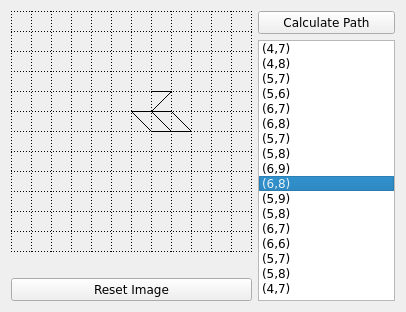

# Criss cross knitting path finder

This code repository is an implementation of the algorithm for finding the criss cross knitting path to get the perfect backside
## Getting Started ##

  * Clone repository


## Platforms ##

  * Linux (Manually tested on ArchLinux)
  
### Requirements

These are the base requirements to build

  * Cmake
  * A C++17-standard-compliant compiler
  * QT 4+
  
  
## Installing 

```bash
   chmod u+x build.sh
   ./build.sh
```  
File will be written to the folder "bin"

## How to use

Current solution based on QT with painting area. Choose wanted cells, then click on "Calculate path".
After finding the path, it will appear along with a list of vertices in the order of the visit. This list is interactive, you can click on a point, then the route will be displayed only up to this point.

### Examples
